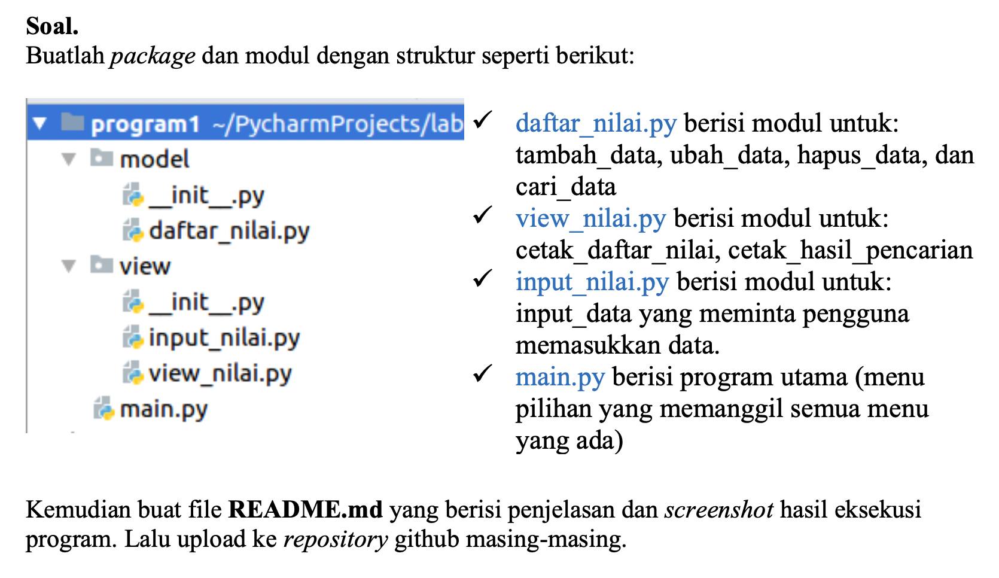
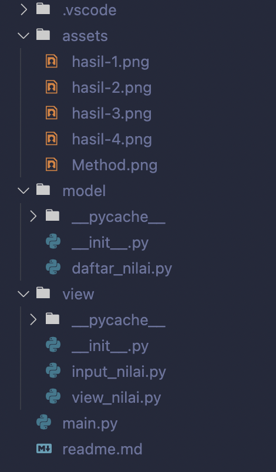
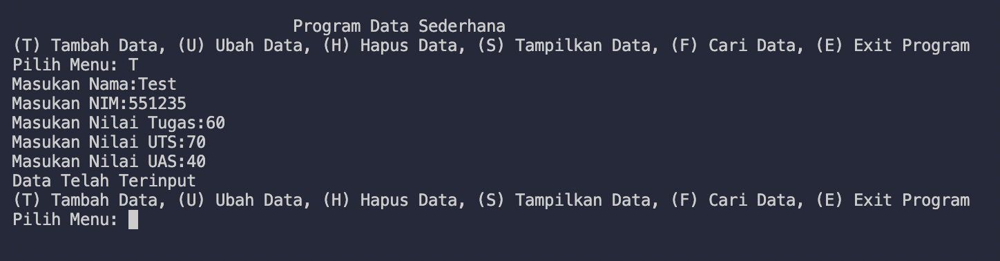
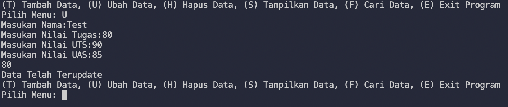
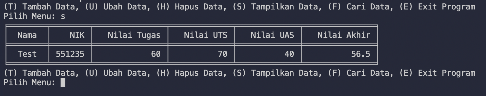
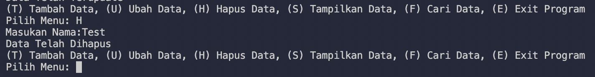

# <p align="center"> UAS Pemrograman

[](https://www.linkedin.com/in/melvian-wijaya-760b371b1/)

<br>

# SOAL [](https://github.com/melviandanuw/UAS-Pemrograman)



<br>

# Susunan Folder 



<br>

# Main.py 

```
main.py merupakan file utama yang menjalankan dan menjalankan method-method.

File ini berisi:

    tampilkan.menu()
```

<br>

# Module View 

```
Berisi 3 file, yaitu:

1. __init__.py sebagai deklarasi bahwa module View merupakan berbentuk module python, file ini dibiarkan kosong karena tidak digunakan sebagai penampung import packages dan function.

2. input_nilai.py berisi class data dan method-method yang digunakan untuk menerima inputan user.

3. view_nilai.py berisi class dan method yang digunakan untuk menampilkan table data.
```

<br>

# Module Model 

```
Berisi 2 file, yaitu:

1. __init__.py sebagai deklarasi bahwa module View merupakan berbentuk module python, file ini dibiarkan kosong karena tidak digunakan sebagai penampung import packages dan function.

2. daftar_nilai.py merupakan file services yang digunakan untuk menampung services/method yang digunakan untuk menambah data, update, delete, search, serta menampilkan table data.
```

<br>

# Hasil Run Program 

1. Menambah Data
   

2. Ubah Data
   

3. Tampilkan Data
   

4. Hapus Data
   

---

<p align="Center"> Made With ❤️<p>
